# Swiss Transit Explorer (MCP)

Decision-ready Swiss public transit planning with live disruptions, risk scoring, and ChatGPT widgets.

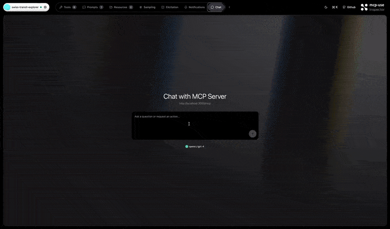

## What this app does

- Returns ranked connection options with reasons and risk levels.
- Scores risk based on tight transfers, delays, and (optionally) weather exposure.
- Adds buffer-aware departure guidance for arrive-by requests.
- Enriches line IDs with GTFS mapping (IR/S/IC/Bus + operator) when available.
- Ships two widgets: a route explorer and a live station board (departures/arrivals).

## How it works

1. **Connections + station boards** come from the public `transport.opendata.ch` API.
2. **GTFS static feed** (optional) maps raw IDs to human-friendly line names.
3. **Risk scoring** evaluates transfers, delay signals, and peak-time penalties.
4. **Weather insights** (Open-Meteo) are pulled only when explicitly requested.
5. **Decision summary** produces ranked options with reasons and buffers.

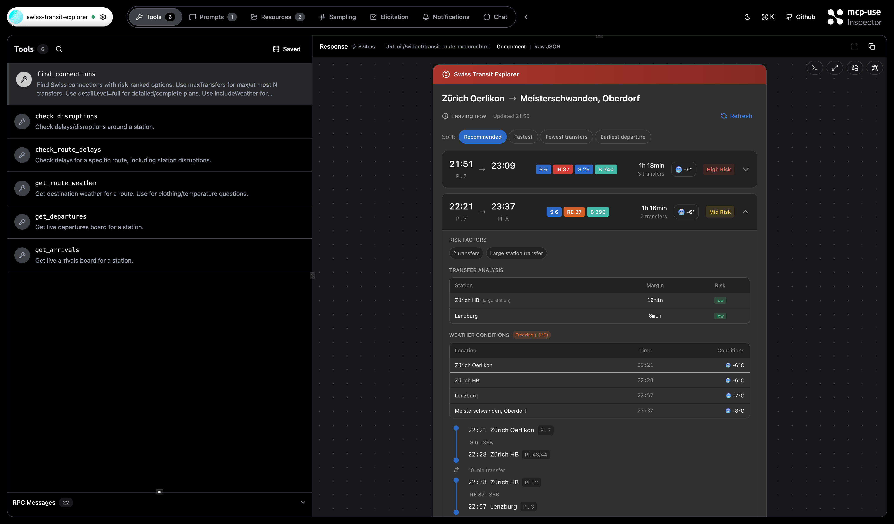

## Tools

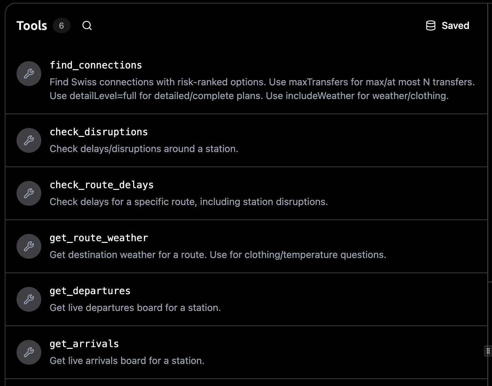

### `find_connections`
Find connections with risk-ranked options and widget output.

Parameters (most common):
- `from`, `to` (string)
- `datetime` (string, optional, e.g. `2026-01-06T18:00` or `18:00`)
- `isArrivalTime` (boolean, optional)
- `limit` (number, optional)
- `maxTransfers` (number, optional)
- `preferLowWalking` (boolean, optional)
- `minimizeOutdoorIfRaining` (boolean, optional)
- `bufferMinutes` (number, optional)
- `detailLevel` (`compact` | `full`)
- `includeWeather` (boolean, optional)

Example (arrive-by with buffers + low walking):
```json
{
  "from": "Zurich Oerlikon",
  "to": "Meisterschwanden",
  "datetime": "09:10",
  "isArrivalTime": true,
  "bufferMinutes": 8,
  "maxTransfers": 1,
  "preferLowWalking": true,
  "detailLevel": "full"
}
```

Related screenshots:
- 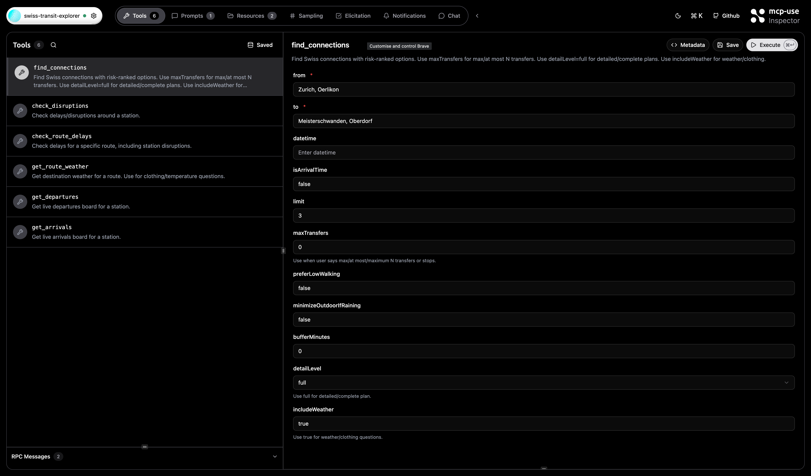
- 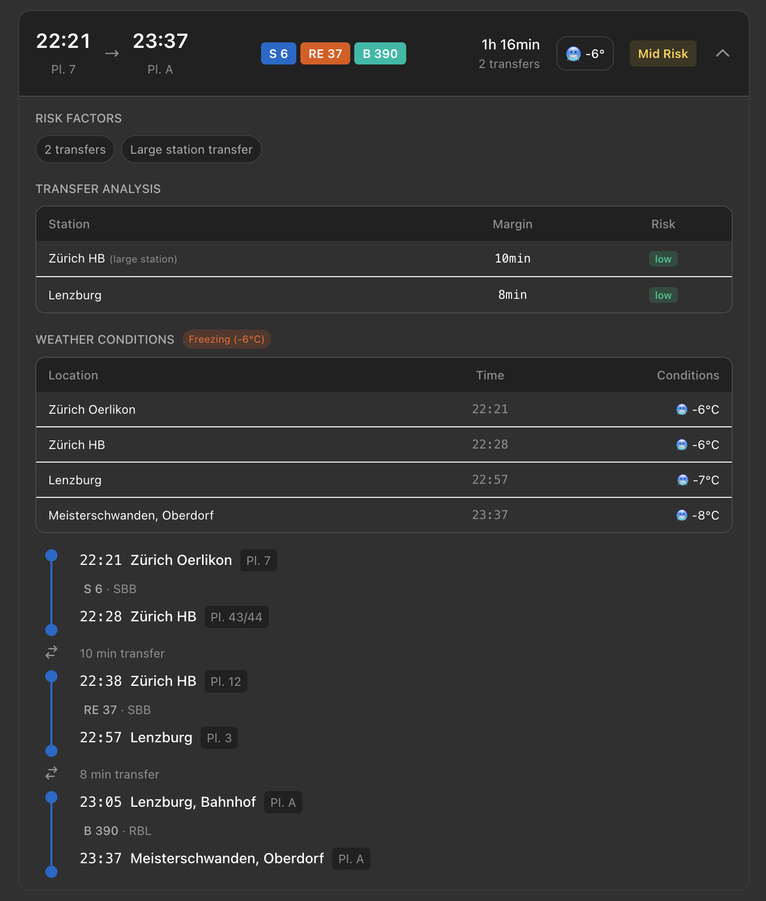

### `check_disruptions`
Check station-wide disruptions and delay patterns.

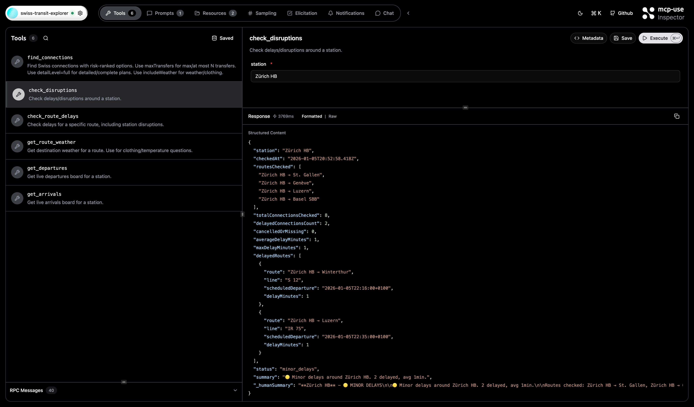

### `check_route_delays`
Check delays for a specific route, including station disruptions.

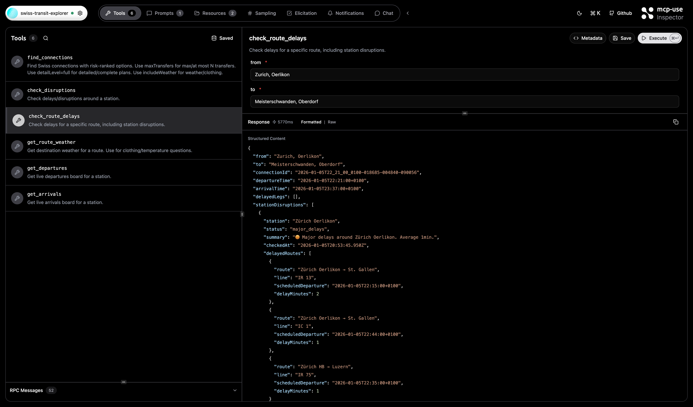

### `get_route_weather`
Get destination weather and clothing advice (uses Open-Meteo).

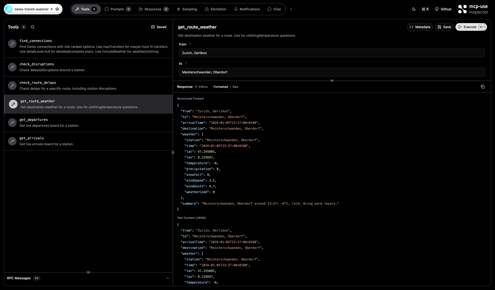

### `get_departures` / `get_arrivals`
Live station boards rendered in a widget.

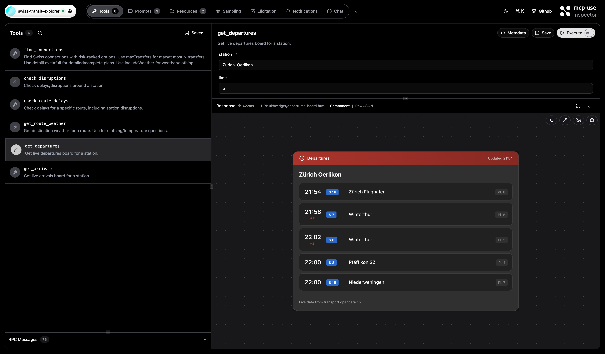
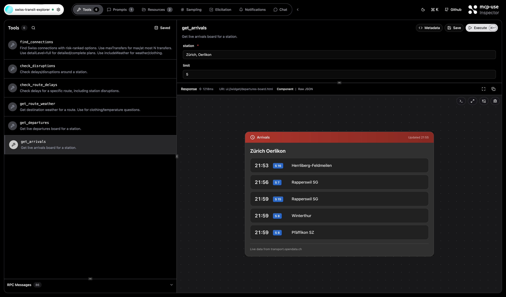

## Widgets

- **transit-route-explorer**: Connection list with risk pills, transfer details, and expandable legs.
- **departures-board**: Live departures/arrivals table for a station.

Both widgets are auto-registered from `resources/` and rendered through Apps SDK output templates.

## Prompt templates

The server exposes a single routing prompt that teaches the model which tool to call and how to map user intent to tool params.

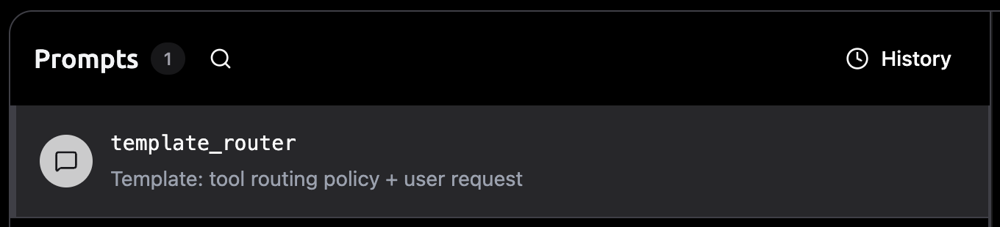

- `template_router`: tool routing policy + user request, used for intent-to-parameter mapping.

## Resources

The app relies on widget resources auto-registered from `resources/`.

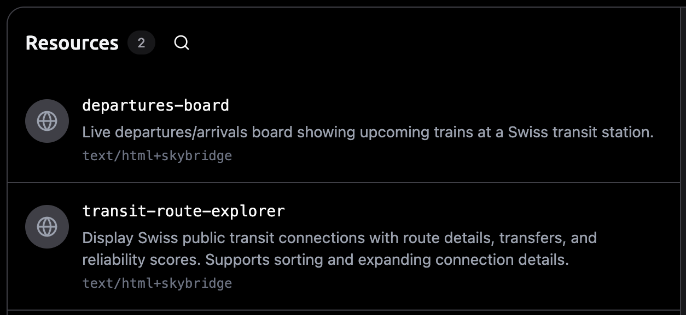

## GTFS line mapping (optional, recommended)

To map raw IDs like `004816` to `IR 16`, `S11`, or `Bus 231`, build a local GTFS lookup.

1) Download a GTFS ZIP from opentransportdata.swiss
2) Build the lookup:
```bash
npm run gtfs:build -- /path/to/gtfs_fpYYYY_YYYYMMDD.zip
```

At runtime, the server loads `data/gtfs-lookup.json` and enriches lines with:
- `lineDisplay` (e.g. `IR 16`)
- `lineType` (train/bus/tram)
- `operator` (SBB, BLS, PostAuto, ...)

## Run locally

```bash
npm install
npm run dev
```

- Server: `http://localhost:3000/mcp`
- Inspector: `http://localhost:3000/inspector`

## Using it in ChatGPT

1. Activate Developer Mode in ChatGPT
2. Add a new app and enter the MCP server URL.
3. Ask for a route or a station board.

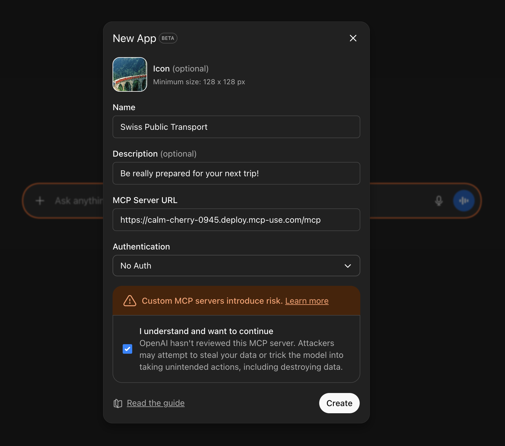
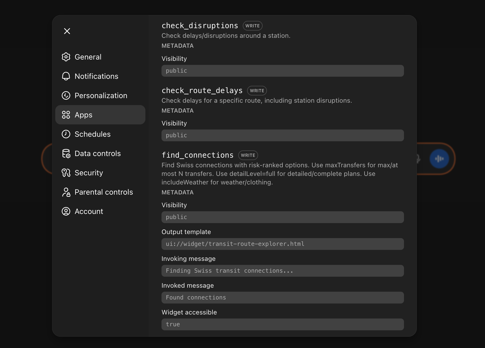

Example prompts:
- "Get me to Zurich HB by 09:10 with max 1 transfer; prefer low walking; if it rains, minimize outdoor time."
- "Show me the live departures for Zurich HB."
- "Is there any delay on the 17:15 connection from Oerlikon to Lugano?"

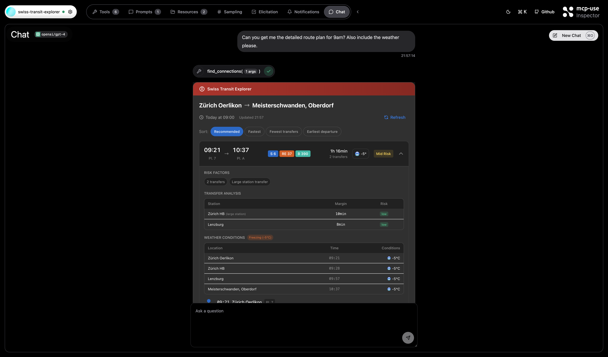


## Deployment

Deploy to mcp-use cloud:
```bash
mcp-use deploy
```

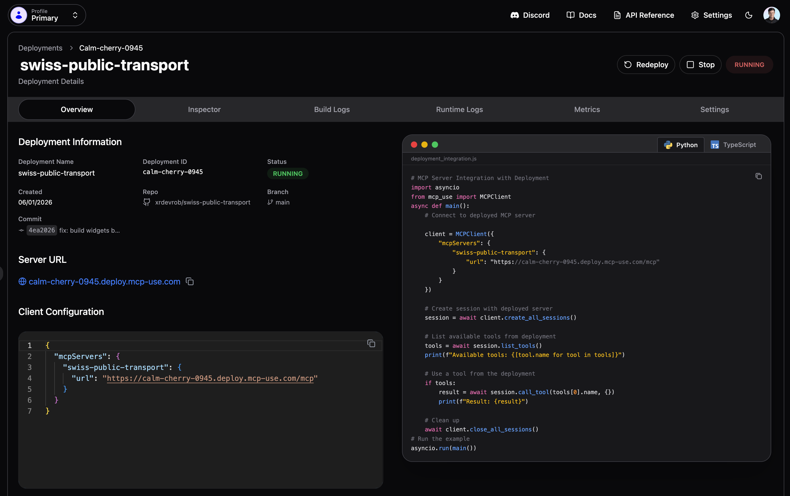

## Data sources

- Connections + stationboard: `https://transport.opendata.ch`
- Weather: `https://api.open-meteo.com`
- GTFS static data: `https://opentransportdata.swiss`
